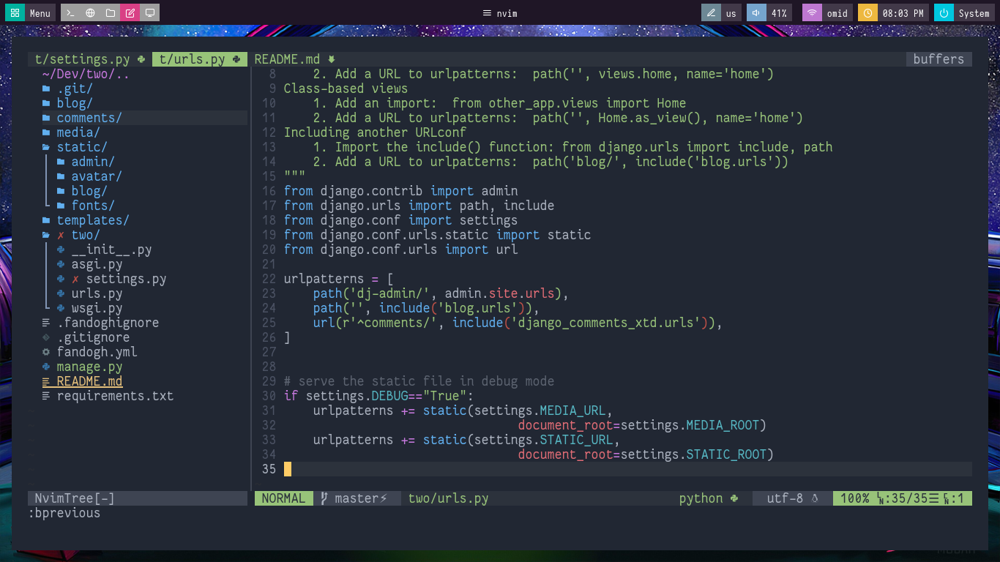
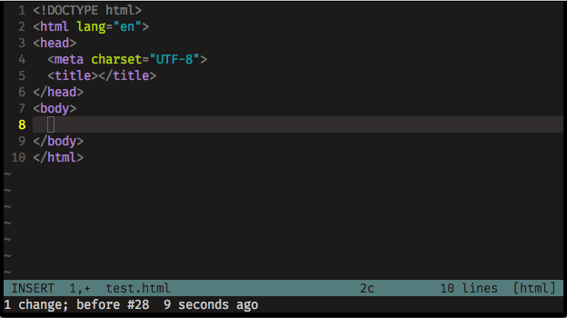

# neovim config guide

[dotfiles](https://github.com/techwithomid/dotfiles)

this is my neovim config for Python/Django and Javascript development.

you can install this config file by cloning the repo and installing the dependency (you can see it in Installation part).

also you can see shortcuts and plugin config after Installation part.

## Installation
## Script
clone the repo
```bash
git clone https://github.com/techwithomid/neovim-conf
```
and run the installation script using this command
```bash
chmod +x installation-script.sh
./installation-scirpt.sh
```
note: this installation script work only with arch based distros


## Manual
1. neovim
    - ubuntu:
        ```bash 
        sudo apt install neovim
        ```
    - Arch:
        ```bash 
        sudo pacman -S neovim
        ```
---
2. vim-plug (plugin manager):
 ```bash 
curl -fLo ~/.config/nvim/autoload/plug.vim --create-dirs https://raw.githubusercontent.com/junegunn/vim-plug/master/plug.vim
```
3. xsel
    - Ubuntu:
        ```bash
        sudo apt install xsel
        ```
      - Arch:
      ```bash
      sudo pacman -S xsel
      ```
---
4. npm :
      - Ubuntu:
        ```bash
        curl -fsSL https://deb.nodesource.com/setup_16.x | sudo -E bash -
        sudo apt-get install -y nodejs
        ```
      - Arch:
        ```bash
        pacman -S nodejs npm
        ```
---
5. neovim python and node support
```bash
pip install pynvim
npm i -g neovim
```
---
6. Ranger

    - Ubuntu
    ```bash
    sudo apt install ranger
    ```

    - Arch
    ```bash
    sudo pacman -S ranger
    ```

install ranger devicons:
```bash
git clone https://github.com/alexanderjeurissen/ranger_devicons ~/.config/ranger/plugins/ranger_devicons
```
**_You can now add default_linemode devicons to your rc.conf_**

+ **Install Ueberzug(use for preview images in ranger)**:
    - Ubuntu(Note you may experience your images being badly placed this is because pip doesn't have the newest version of ueberzug, if you find this issue please install from source)
        ```bash
            pip install ueberzug
        ```
    - Arch
        ```bash
            yay -S python-ueberzug-git
        ```

Ranger config file:
make sure you create a ranger config file and at least add the following lines
```bash
mkdir ~/.config/ranger

touch ~/.config/ranger/rc.conf
```

Add this configuration to rc.conf

```bash
set preview_images_method ueberzug

default_linemode devicons

set show_hidden true
```

7. fzf
    - Ubuntu:
    ```bash
    sudo apt install fzf
    ```
    -Arch
    ```bash
    sudo pacman -S fzf
    ```

## general shortcuts
Use `alt` + hjkl to resize windows

Use `ctrl` + hjkl to navigate windows

Use `ctrl` `u` over word for make it Uppercase

You can execute python, sh, Javascript code in neovim with `leader` `r`

TAB in general mode will move to next buffer SHIFT-TAB will go back

alternative save&quit :
   - Use  `ctrl` `s` => save (:w) 
   - `ctrl` `Q` save and quite(:wq!)

Use `ctrl` `c` instead of escape


## Extenction config
### lsp
Recently I switch lsp over coc, and here is some shortcuts and configuration of my lsp.

`gd`  go to definition.

`gD`  go to declaration.

`gr`  go to references.

`gi`  go to implementation.

`K`   Hover and show more additional information.

`ctrl` `n` go to next diagnostic.

`ctrl` `p` go to previous diagnostic.

also auto formate is active for '.py' '.js' '.jsx' files

for install language see this [link](https://github.com/neovim/nvim-lspconfig)

---

### Emmet

my command to trigger the Emmet’s magic is: `,,` (comma comma) , simple and close to the fingers!

examples:

type `html:5` in INSERT mode then press comma two time `,,` like this gif


also you can create tags like `div` or custome tag like `myname` like this gif


let’s add a `<div>` with a `<p>` inside, that contains a link `<a href="">` for this example we use `>` operator so just type `div>p>a` and `,,` see this gif


You can define html attributes to the elements using the same convention used by CSS.

Let’s try with the previous example, adding a `.container` class to the `<div>`, a `#foo` id to the `<p>` tag.
type `div.container>p#foo>a` and `,,`


Let’s say you want a <div> with 5 `<p>` inside of it, just go with `div>p*5`:


also if you want more information check this [link](https://github.com/mattn/emmet-vim).

---

### MarkdownPreview
I use markdown-preview plugin for preview markdown in neovim and it's work really well.

use `:MarkdownPreview` or `leader` `p` to see the preview in your default browser.

more information about [markdown-preview plugin](https://github.com/iamcco/markdown-preview.nvim
).

---

### FZF
FZF is awesome tool for use inside neovim and It's much much more faster than ranger and coc-explorer. here is shortcuts and fzf commands.

* use `leader` `f` to open `:Files` where you can search for your files.
* `leader` `b` or `:Buffers` for search in your open buffer.
* `leader` `g` or `:Rg` search for mach result in files content and file name.
* `leader` `t` or `:Tags` search for Tags
* `leader` `m` or `:Marks` search for marks

also you can open files in split or new tab.
* tab split : `ctrl` `t`
* split     : `ctrl` `x`
* vsplit    : `ctrl` `v`

---

### nvim-tree
A File Explorer For Neovim Written In Lua.

**keybindings**:
   - move around like in any vim buffer
   - `<CR>` or `o` on `..` will cd in the above directory
   - `<C-]>` will cd in the directory under the cursor
   - `<BS>` will close current opened directory or parent
   - type `a` to add a file. Adding a directory requires leaving a leading `/` at the end of the path.
     > you can add multiple directories by doing foo/bar/baz/f and it will add foo bar and baz directories and f as a file
   - type `r` to rename a file
   - type `<C-r>` to rename a file and omit the filename on input
   - type `x` to add/remove file/directory to cut clipboard
   - type `c` to add/remove file/directory to copy clipboard
   - type `y` will copy name to system clipboard
   - type `Y` will copy relative path to system clipboard
   - type `gy` will copy absolute path to system clipboard
   - type `p` to paste from clipboard. Cut clipboard has precedence over copy (will prompt for confirmation)
   - type `d` to delete a file (will prompt for confirmation)
   - type `]c` to go to next git item
   - type `[c` to go to prev git item
   - type `-` to navigate up to the parent directory of the current file/directory
   - if the file is a directory, `<CR>` will open the directory otherwise it will open the file in the buffer near the tree
   - if the file is a symlink, `<CR>` will follow the symlink (if the target is a file)
   - `<C-v>` will open the file in a vertical split
   - `<C-x>` will open the file in a horizontal split
   - `<C-t>` will open the file in a new tab
   - `<Tab>` will open the file as a preview (keeps the cursor in the tree)
   - `I` will toggle visibility of folders hidden via |g:nvim_tree_ignore|
   - `H` will toggle visibility of dotfiles (files/folders starting with a `.`)
   - `R` will refresh the tree
   - Double left click acts like `<CR>`
   - Double right click acts like `<C-]>`

more informtion about [nvim-tree](https://github.com/kyazdani42/nvim-tree.lua)

---

### Treesitter
treesitter is parser for better syntax highlight and more things.
you just need to install language you want just run this command:
`:TSInstall <lang>`

for more information see this [link](https://github.com/nvim-treesitter/nvim-treesitter)

---

### telescop
telescope.nvim is a highly extendable fuzzy finder over lists. Built on the latest awesome features from neovim core. Telescope is centered around modularity, allowing for easy customization.

here is here is shortcuts I use. but you can see the telescope docs [here](https://github.com/nvim-telescope/telescope.nvim)

find files use `leader` `f` or `:Telescope find_file`

find live greps use `leader` `fg` or `:Telescope live_grep`

find buffers use `leader` `fb` or `:Telescope buffers`

help tags use `leader` `fh` or `:Telescope help_tags`

also this is some useful shortcut for use with telescope preview

| Mappings       | Action                           |
|----------------|----------------------------------|
| `<C-n>/<Down>` | Next item                        |
| `<C-p>/<Up>`   | Previous item                    |
| `j/k`          | Next/previous (in normal mode)   |
| `<cr>`         | Confirm selection                |
| `<C-x>`        | go to file selection as a split  |
| `<C-v>`        | go to file selection as a vsplit |
| `<C-t>`        | go to a file in a new tab        |
| `<C-u>`        | scroll up in preview window      |
| `<C-d>`        | scroll down in preview window    |
| `<C-c>`        | close telescope                  |
| `<Esc>`        | close telescope (in normal mode) |

---

### vim-maximizer
Maximizes and restores the current window in Vim.

use `Ctrl` `f` or `:MaximizerToggle`

## TODO
- [ ] make the shortcuts guide cleaner 
- [ ] create bash script to automate the installation
- [x] add git integration
- [x] fix signify conflit with line number
- [x] add more information about emmet plugin
- [x] add markdown preview to nvim
